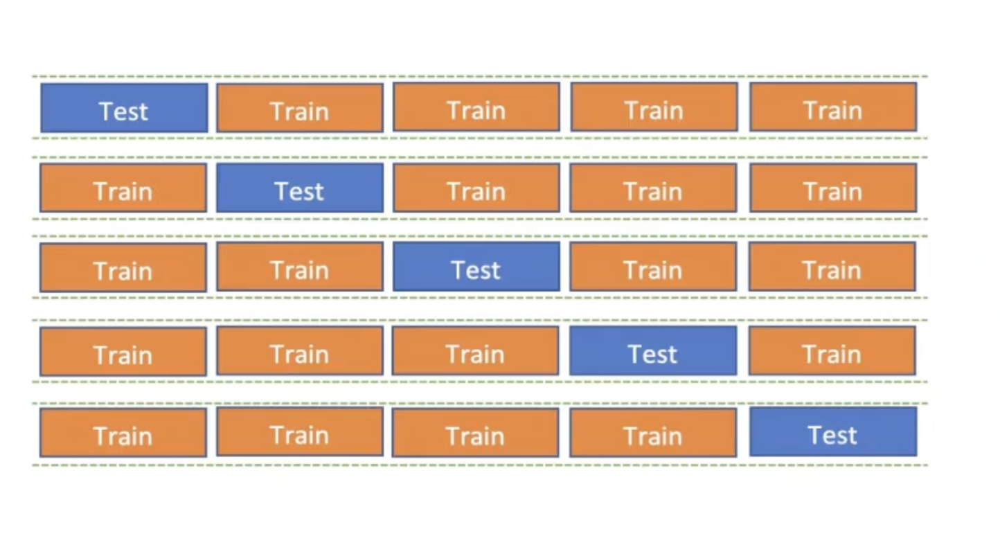

--- 
author: "Simone Brazzi"
date: "2026-01-07" 
execute:
  echo: true
  warning: false
  error: false
theme: 
  dark: darkly
  light: flatly
--- 

# 1. Theory

- Parameters -> elements of the math formula which define the model.
- Hyperparameters -> elements which modify how the train and fit happen.

Decision Tree
- *p*, threshold which defines the decision.
- *criterion*, *splitter*, *max_depth*.

## 1.1. Bias Variance Tradeoff

- Bias -> error due to overly simplistic assumptions in the learning algorithm. It does not get the correct solution.
- Variance -> error due to too much complexity in the learning algorithm. The spread of the solution.


## 1.2. Evaluation Metrics

### 1.3. Regression

- Mean Squared/Absolute Error (MS/AE) -> difference between prediction and real value.
- (Symmetrical) Mean Percentage Absolute Error ((S)MAPE) -> absolute difference between prediction and real value.
  - < 0.2 good model.
  - < 0.05 great model.
- R Squared (R²) -> proportion of variance explained by the model.
  - 1 perfect model.
  - 0 model does not explain anything.
  - Complement to 1 is the variance unexplained by the model.
  - > 0.75 good model.
  - > 0.95 great model.

### 1.4. Classification

- Accuracy -> proportion of correct predictions.
  - > 0.9 good model.
  - > 0.95 great model.
- Precision -> proportion of positive identifications that were actually correct.
- Recall -> proportion of actual positives that were identified correctly.
- F1 Score -> harmonic mean of precision and recall.

All of them are % and the higher the better.

### 1.5. Neural Networks

- All the above plus
- Loss Function -> function that measures how well the model's predictions match the actual target values during training.
  - The lower the loss, the better the model is performing.
  - The graph start from 1 on the y axis because of the way the loss is calculated and tends to decrease as the model learns asymptotically towards 0.

# 2. Cross Validation

**Underfitting** -> the model does not capture the underlying trend of the data. High bias, low variance.
**Overfitting** -> the model captures noise instead of the underlying trend. Low bias, high variance.
**Leakege** -> when information from outside the training dataset is used to create the model.

## 2.1. Holdout Validation


[Train]{style="color: #F57927"} -> [Test]{style="color: #1E61FA"}

Except time series, it has to be random shuffled.


## 2.2. K-Fold Cross Validation



k folds -> k models trained and evaluated.

## 2.3. Leave One Out Cross Validation (LOOCV)

k = the number of samples in the dataset.
Useful for small datasets, but computationally expensive.

## 2.4. Stratified K-Fold Cross Validation

Useful in a classification problem with imbalanced classes: it keeps the same proportion of classes in each fold as in the whole dataset.

# 2. Practice


## 2.1. Holdout Validation Example


```{python}
from sklearn.datasets import fetch_california_housing
from sklearn.linear_model import LinearRegression
from sklearn.model_selection import train_test_split
from sklearn.metrics import (
    mean_squared_error,
    mean_absolute_error,
    mean_absolute_percentage_error,
    r2_score,
)


def holdout_regression(x, y, testSize):

    xtrain, xtest, ytrain, ytest = train_test_split(
        x, y, test_size=testSize, random_state=42
    )

    model = LinearRegression()
    model.fit(xtrain, ytrain)

    ytrain_pred = model.predict(xtrain)
    ytest_pred = model.predict(xtest)
    mse_train = round(mean_squared_error(ytrain, ytrain_pred), 2)
    mse_test = round(mean_squared_error(ytest, ytest_pred), 2)
    mae_train = round(mean_absolute_error(ytrain, ytrain_pred), 2)
    mae_test = round(mean_absolute_error(ytest, ytest_pred), 2)
    mape_train = round(100 * mean_absolute_percentage_error(ytrain, ytrain_pred), 2)
    mape_test = round(100 * mean_absolute_percentage_error(ytest, ytest_pred), 2)
    r2_train = round(100 * r2_score(ytrain, ytrain_pred), 2)
    r2_test = round(100 * r2_score(ytest, ytest_pred), 2)
    print("HOLDOUT REGRESSION RESULTS")
    print(f"TRAIN MSE: {mse_train} vs TEST MSE {mse_test}")
    print(f"TRAIN MAE: {mae_train} vs TEST MAE {mae_test}")
    print(f"TRAIN MAPE: {mape_train}% vs TEST MAPE {mape_test}%")
    print(f"TRAIN R2: {r2_train}% vs TEST R2 {r2_test}%")

    return
```

```{python}
california_housing = fetch_california_housing()
x, y = california_housing.data, california_housing.target

print(f"HoldOut CV")
holdout_regression(x, y, testSize=0.2)
```

## 2.2. Kfold Cross Validation Example

Notice how the scoring, except for the R2, is defined as negative, so that the solution is always an optimization problem where higher is better.


```{python}
import numpy as np
from sklearn.datasets import fetch_california_housing
from sklearn.linear_model import LinearRegression
from sklearn.model_selection import cross_validate


def cross_validation_regression(x, y, cv):

    Model = LinearRegression()
    Scoring = {
        'MSE' : 'neg_mean_squared_error',
        'MAE' : 'neg_mean_absolute_error',
        'MAPE' : 'neg_mean_absolute_percentage_error',
        'R2' : 'r2'
    }
    CVResults = cross_validate(
    estimator=Model,
    X=x, y=y,
    cv=cv,
    scoring=Scoring,
    return_train_score=True
    )
    train_mse = round(np.mean(-CVResults['train_MSE']), 2)
    test_mese = round(np.mean(-CVResults['test_MSE']), 2)
    train_mae = round(np.mean(-CVResults['train_MAE']), 2)
    test_mae = round(np.mean(-CVResults['test_MAE']), 2)
    train_mape = round(100 * np.mean(-CVResults['train_MAPE']), 2)
    test_mape = round(100 * np.mean(-CVResults['test_MAPE']), 2)
    train_r2 = round(100 * np.mean(CVResults['train_R2']), 2)
    test_r2 = round(100 * np.mean(CVResults['test_R2']), 2)

    print(f'CV Validation Regression')
    print(f'train mse: {train_mse} vs test mse: {test_mese}')
    print(f'train mae: {train_mae} vs test mae: {test_mae}')
    print(f'train mape: {train_mape}% vs test mape: {test_mape}%')
    print(f'train r2: {train_r2}% vs test r2: {test_r2}%')

    return

```

```{python}
california_housing = fetch_california_housing()
x, y = california_housing.data, california_housing.target

print("5 Fold CV")
cross_validation_regression(x, y, cv=5)
print("\n10 Fold CV")
cross_validation_regression(x, y, cv=10)
```

## 2.3. Leave One Out Cross Validation Example

```{python}
import numpy as np
from sklearn.datasets import load_iris
from sklearn.tree import DecisionTreeClassifier
from sklearn.model_selection import cross_validate, LeaveOneOut
from sklearn.metrics import (
    accuracy_score,
    precision_score,
    recall_score,
    f1_score,
    make_scorer,
)


def leave_one_out(x, y, depth):

    loo = LeaveOneOut()
    Model = DecisionTreeClassifier(criterion="gini", max_depth=depth, random_state=42)

    accuracy_scorer = "accuracy"
    precision_scorer = make_scorer(precision_score, average="weighted", zero_division=0)
    recall_scorer = make_scorer(recall_score, average="weighted", zero_division=0)
    f1_scorer = make_scorer(f1_score, average="weighted", zero_division=0)
    Scoring = {
        "accuracy": accuracy_scorer,
        "precision": precision_scorer,
        "recall": recall_scorer,
        "f1": f1_scorer,
    }

    CVResults = cross_validate(
        Model, x, y, cv=loo, scoring=Scoring, return_train_score=True
    )

    train_accuracy = round(100 * np.mean(CVResults["train_accuracy"]), 2)
    test_accuracy = round(100 * np.mean(CVResults["test_accuracy"]), 2)
    train_precision = round(100 * np.mean(CVResults["train_precision"]), 2)
    test_precision = round(100 * np.mean(CVResults["test_precision"]), 2)
    train_recall = round(100 * np.mean(CVResults["train_recall"]), 2)
    test_recall = round(100 * np.mean(CVResults["test_recall"]), 2)
    train_f1 = round(100 * np.mean(CVResults["train_f1"]), 2)
    test_f1 = round(100 * np.mean(CVResults["test_f1"]), 2)

    print(
        f"LOO Classification | train accuracy: {train_accuracy}% vs test accuracy: {test_accuracy}%"
    )
    print(
        f"LOO Classification | train precision: {train_precision}% vs test precision: {test_precision}%"
    )
    print(
        f"LOO Classification | train recall: {train_recall}% vs test recall: {test_recall}%"
    )
    print(f"LOO Classification | train f1: {train_f1}% vs test f1: {test_f1}%")

    return


iris = load_iris()
x, y = iris.data, iris.target
print(f"Leave One Out Classification")

leave_one_out(x, y, depth=2)
leave_one_out(x, y, depth=10)
leave_one_out(x, y, depth=20)
```
## 2.4. Stratified K-Fold Cross Validation Example


```{python}
import numpy as np
from sklearn.datasets import load_iris
from sklearn.neural_network import MLPClassifier
from sklearn.model_selection import StratifiedKFold, cross_validate
from sklearn.metrics import (
    accuracy_score,
    precision_score,
    recall_score,
    f1_score,
    make_scorer,
)


def stratified_kfold_classification(x, y, n_splits):

    skf = StratifiedKFold(n_splits=n_splits, shuffle=True, random_state=42)

    Model = MLPClassifier(
        hidden_layer_sizes=(50,),
        activation="relu",
        batch_size="auto",
        max_iter=1000,
        random_state=42,
    )

    accuracy_scorer = "accuracy"
    precision_scorer = make_scorer(precision_score, average="weighted", zero_division=0)
    recall_scorer = make_scorer(recall_score, average="weighted", zero_division=0)
    f1_scorer = make_scorer(f1_score, average="weighted", zero_division=0)
    Scoring = {
        "accuracy": accuracy_scorer,
        "precision": precision_scorer,
        "recall": recall_scorer,
        "f1": f1_scorer,
    }

    CVResults = cross_validate(
        Model, x, y, cv=skf, scoring=Scoring, return_train_score=True
    )

    train_accuracy = round(100 * np.mean(CVResults["train_accuracy"]), 2)
    test_accuracy = round(100 * np.mean(CVResults["test_accuracy"]), 2)
    train_precision = round(100 * np.mean(CVResults["train_precision"]), 2)
    test_precision = round(100 * np.mean(CVResults["test_precision"]), 2)
    train_recall = round(100 * np.mean(CVResults["train_recall"]), 2)
    test_recall = round(100 * np.mean(CVResults["test_recall"]), 2)
    train_f1 = round(100 * np.mean(CVResults["train_f1"]), 2)
    test_f1 = round(100 * np.mean(CVResults["test_f1"]), 2)

    print(
        f"Stratified K-Fold NN| train accuracy: {train_accuracy}% vs test accuracy: {test_accuracy}%"
    )
    print(
        f"Stratified K-Fold NN| train precision: {train_precision}% vs test precision: {test_precision}%"
    )
    print(
        f"Stratified K-Fold NN| train recall: {train_recall}% vs test recall: {test_recall}%"
    )
    print(f"Stratified K-Fold NN| train f1: {train_f1}% vs test f1: {test_f1}%")

    return


iris = load_iris()
x, y = iris.data, iris.target

print("Stratified K Fold NN | 5 Fold")
stratified_kfold_classification(x, y, n_splits=5)
print("Stratified K Fold NN | 10 Fold")
stratified_kfold_classification(x, y, n_splits=10)
```


